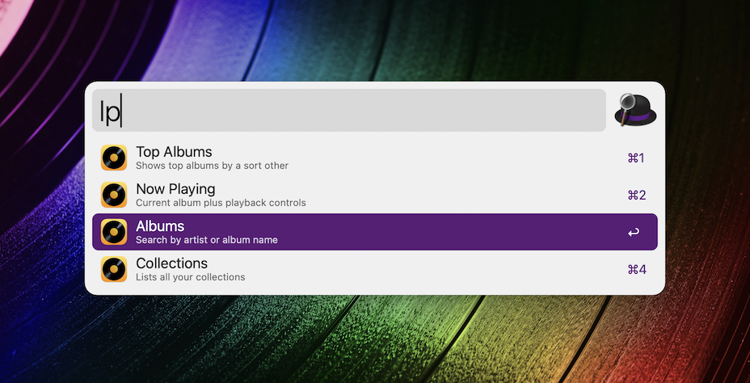
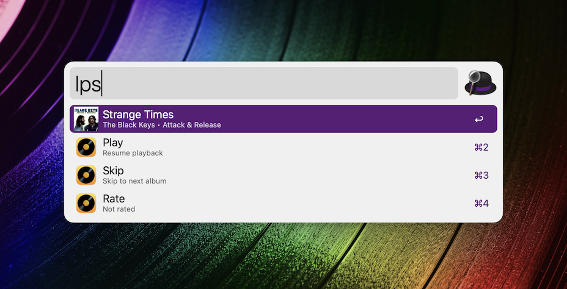

# Alfred Workflow for Longplay for Mac

- App website: [`longplay.rocks`](https://longplay.rocks)

## Download

See GitHub releases for download of the workflow, and see the `scripts` folder for the individual JXA scripts.

## Commands

All command start with `lp`:

- `lp $term`: Search for albums and playlists. Then play or enqueue.
- `lpc`: List **c**ollection, then get albums/playlists, or start album shuffle.
- `lpt`: List sort order, then get **t**op albums/playlists for that order, or start album shuffle.
- `lps`: Get now playing **s**tatus, then pause/skip/stop or rate current track.

## Updating the workflow

A manual process for now (see [official docs](https://www.alfredapp.com/blog/guides-and-tutorials/share-workflow-on-github/)):

1. Update in Alfred, select "Export..."
2. Manually update the scripts in this repo and push
3. Create a new release and drop in the file from step 1.

(If anyone has a better way to do this, let me know.)

---

Crafted by [Adrian Schoenig](https://adrian.schoenig.me)
